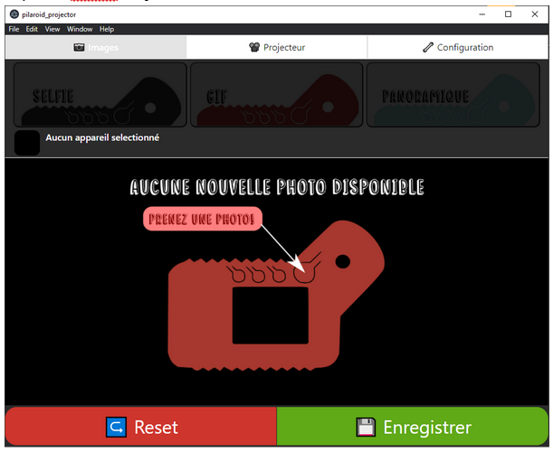
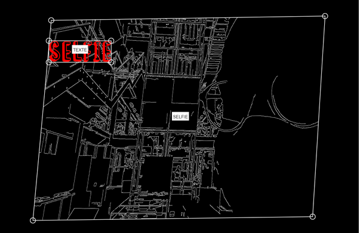

pilaroid_projector
------------------
An nodeJS Electron application to connect all pilaroid to a central hub, to validate photos and display it on a projector.    
Disponible uniquement en français pour le moment.

# Installation
Source code : https://github.com/usini/pilaroid_projector/

# [Download Pilaroid Projector](https://github.com/usini/pilaroid_projector/releases/download/2.0/pilaroid_projector_v2.zip)

